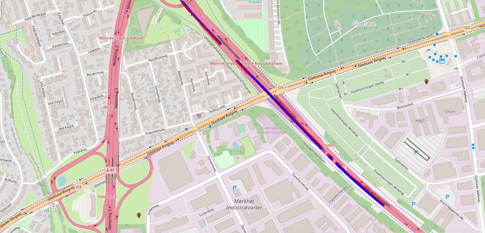

# kNN_track_matching
Module for finding matching GPS points of two trajectories, using k-Mearest Neighbor algorithm.  
(author: Milena Bajic)  

Instructions: 
1. Install packages:  
   pandas, numpy, matplotlib  
   psycopg2 to connect to the database: pip install psycopg2==2.7.7 (or conda if using conda)  
   mplleaflet to plot locations on OSM:  pip install mplleaflet (or conda install -c conda-forge mplleaflet) 
2. Run do_matching.py with chosen parameters

Example output of the matching result (matched GPS points of different trajectories are shown in red and blue):

